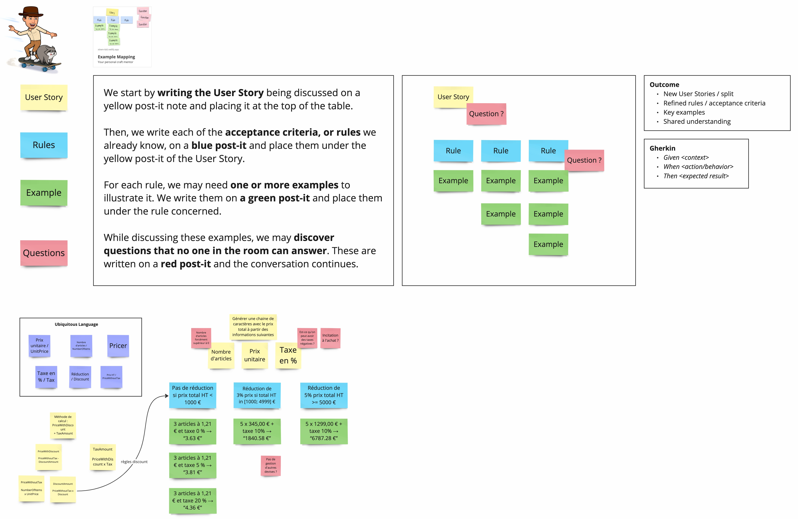

# Pricing Kata
Résolution du kata [calcul de prix](https://github.com/xnopre/xnopre-katas/blob/master/pricer.md) en `C#`/ `.NET 7` / `xUnit` / `FluentAssertions`.

Fait dans le cadre du [kata challenge](https://docs.google.com/document/d/1P09tF9peaGUVAg7F-uGNtAU1r4wkyAdVMxU9VEU_D7A/edit).

## Vidéo

## Example Mapping

Détails à retrouver sur miro [ici](https://miro.com/app/board/uXjVM706BBU=/?share_link_id=431682749138).

## Resources
- [TCR Murex tool](https://github.com/murex/TCR/tree/main)
- [Test && Commit || Revert](https://medium.com/@kentbeck_7670/test-commit-revert-870bbd756864)